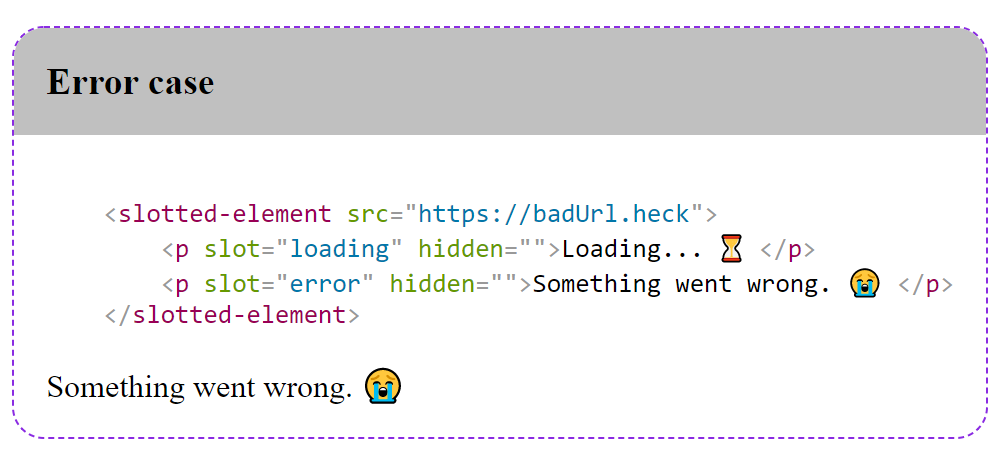

# demo-element
inserts syntax colored HTML in demo-element before actual dom

## Sample
The code

<pre>&lt;demo-section title=&quot;Error case&quot;&gt;
    &lt;slotted-element src=&quot;https://badUrl.heck&quot;&gt;
        &lt;p slot=&quot;loading&quot; hidden&gt;Loading... ⏳ &lt;/p&gt;
        &lt;p slot=&quot;error&quot; hidden&gt;Something went wrong. 😭 &lt;/p&gt;
    &lt;/slotted-element&gt;
&lt;/demo-section&gt;</pre>

renders following content:
